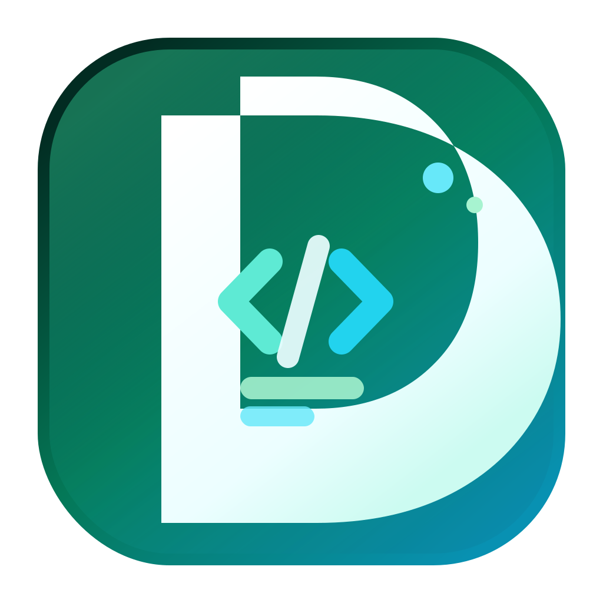

<p align="center">
  
</p>

<div align="center">
  <b>Djass</b><br />
  <b>Web app wrapper around django-saas-starter cookiecutter.</b>
</div>

---

## What is Djass?

Djass is a web app that helps users generate production-ready Django SaaS repositories from `django-saas-starter`.

It is optimized around fast project setup, clear app boundaries, and an AI-friendly codebase structure.

## Product scope

Djass is currently run as a managed application.

- Self-hosting is not officially supported.
- Public open-source deployment guides are intentionally out of scope.

## Documentation

In-app docs live under `/docs` and cover:

- Getting started
- Repository architecture
- Generator options
- Development workflows
- Configuration reference

### Suggested reading order

1. `/docs/getting-started/introduction/`
2. `/docs/getting-started/local-development/`
3. `/docs/architecture/repository-structure/`
4. `/docs/features/generator-options/`
5. `/docs/workflows/adding-a-feature/`

## Local development (for contributors)

### Prerequisites

- Docker + Docker Compose
- `uv`
- Node.js 18+

### Setup

```bash
cp .env.example .env
make serve
```

If the worker fails to attach to Redis during first boot:

```bash
make restart-worker
```

### Common commands

```bash
make manage migrate
make manage createsuperuser
make test
make shell
```

## Project structure

- `apps/core` — shared business logic and core models
- `apps/api` — API routers/schemas
- `apps/pages` — app and marketing pages
- `apps/blog` — blog features (when enabled)
- `apps/docs` — markdown-driven docs app (when enabled)
- `frontend/` — templates and frontend assets

## Notes for maintainers

When architecture, setup, or workflows change, update docs in the same PR.
